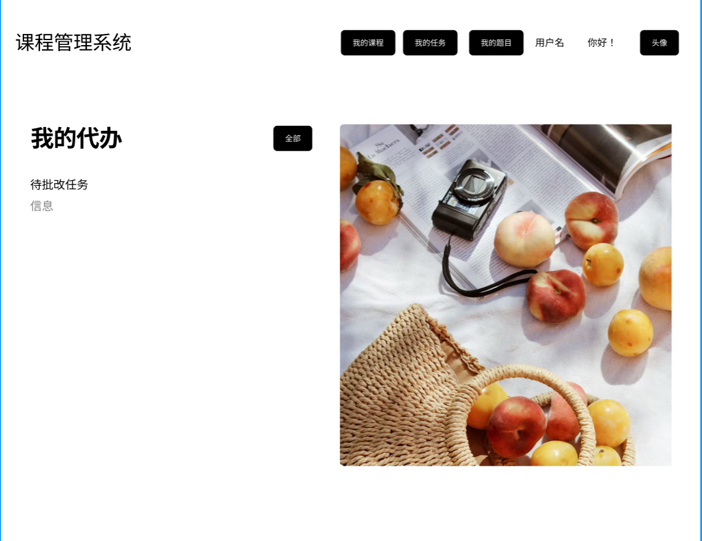
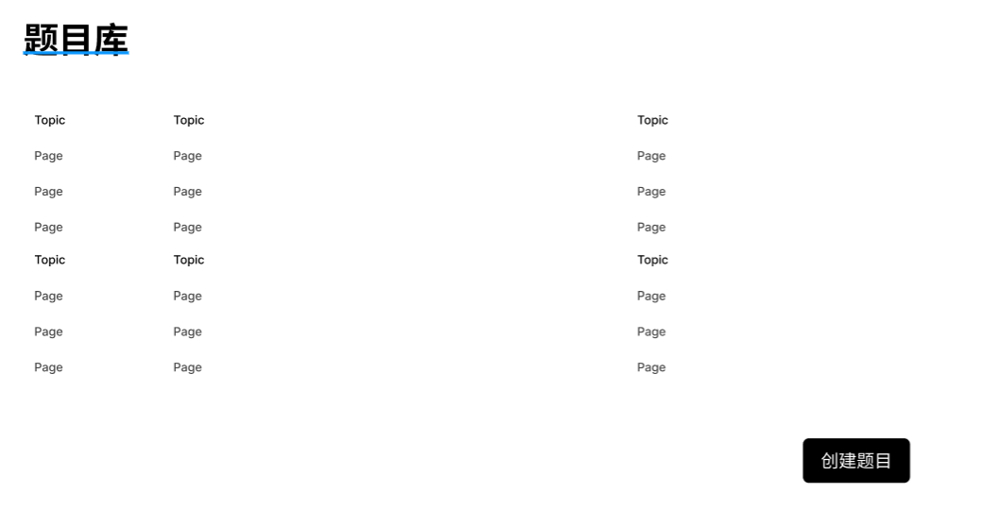
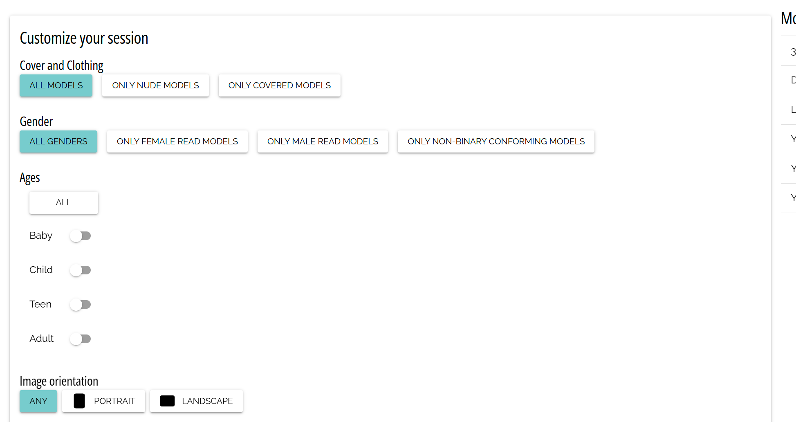
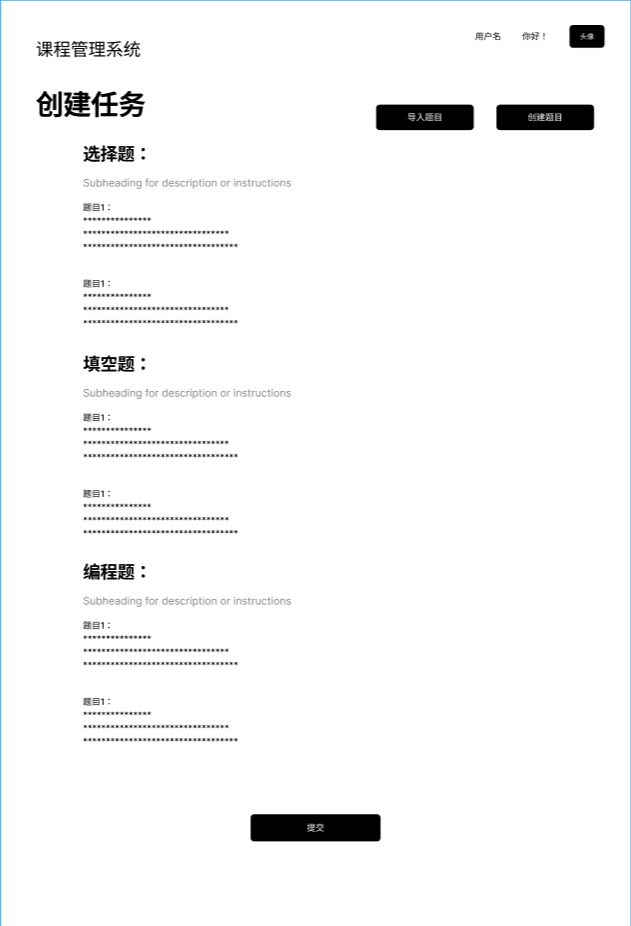
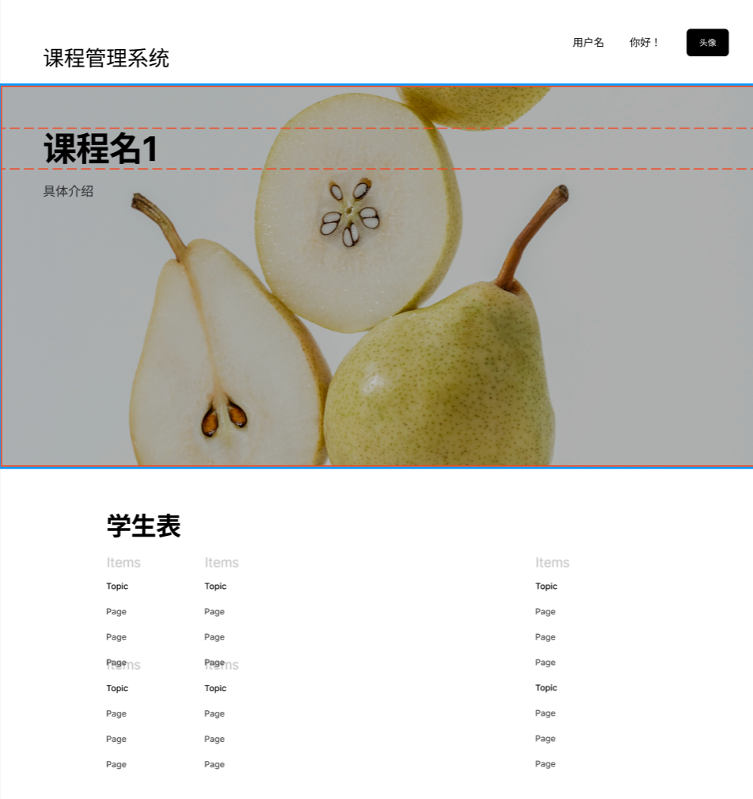
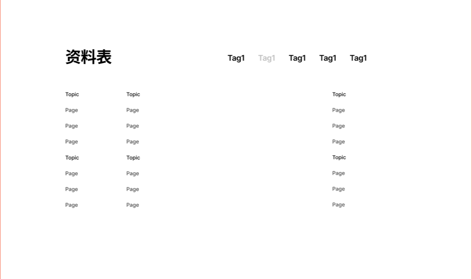
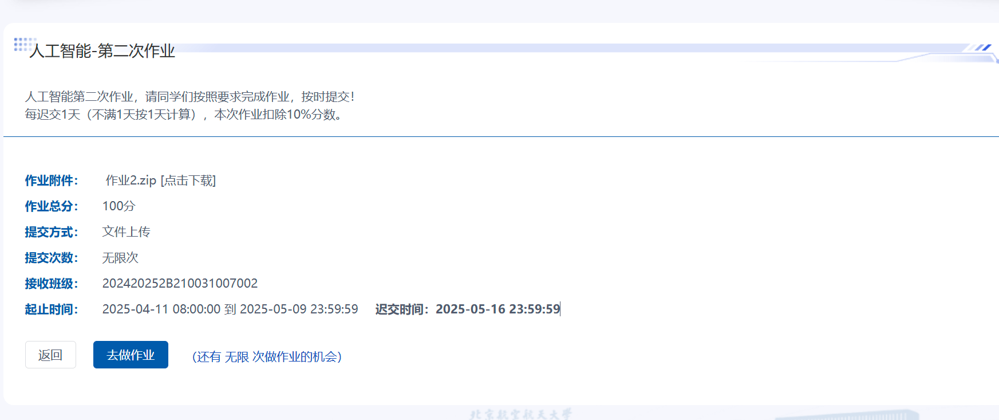
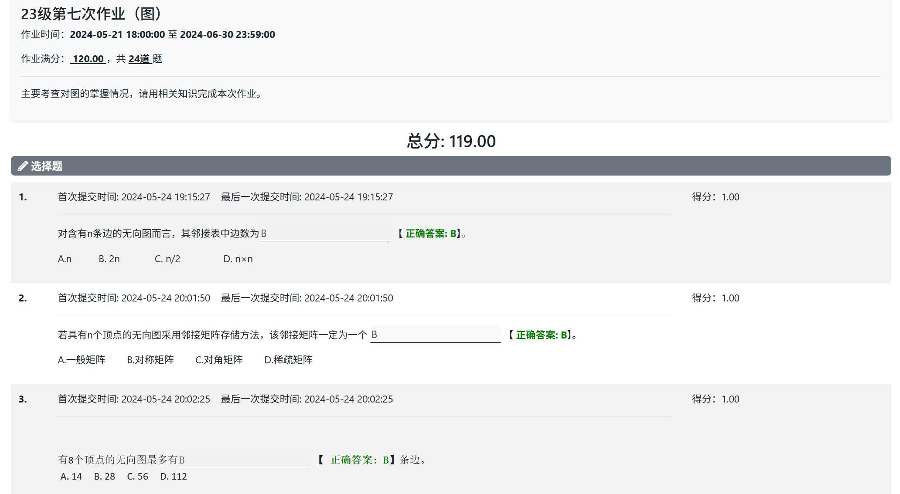

# 原型设计：

> Path:/
> Intro:登录前的介绍界面，对我们网站的功能等进行介绍
> Reference:
> 
> Website:https://tlearning.cloud.tencent.com/
> Request Data: NULL
> Notice:登录注册跳转/login，可以选择老师或学生

> path:/login /register:
> Intro:登录注册页面
>
> Reference:
>
> 

> Path:/home
> Intro:主界面，登录之后最先到达的界面。
> 顶端Header，左侧为标题，右侧：用户名+你好！+头像。Header包装成一个vue文件，避免重复。标题点击跳转/home，头像、用户名点击跳转/profile。在用户名左侧紧贴三个按钮，（这里不是简单的按钮，应是顶端栏的选项，注意美观就行）从左到右：我的课程、我的任务、我的题目，分别可以跳转到对应详细界面：/courses /tasks   /questions。
> 下面顺序展示：我的待办、我的课程、我的任务和题目库，每个部分限制数量，待办部分展示待完成任务（学生）、待批改任务（老师），分页展示所有内容。如果是学生，那么我的课程部分应该添加选项：作为助教/作为学生。我的任务和我的题目部分只需要展示私人的任务或题目。每个部分应该包含 全部 按钮，跳转路径同上。注意学生题目库展示的是收藏/错题，存在选项，老师展示的则是自建的题目。对老师来说，我的课程和我的任务和我的题目下面有按钮 创建课程和创建任务和创建题目，分别跳转到/createCourse 或 /createTask 或 /createQuestion
> 点击单个课程、任务、题目的话，则会跳转到/course/{id}或/task/{id} 或/questions。
> Reference:
> 
> 
> 
> 
> Request Data:作为助教、学生分别的课程（学生），作为老师的课程（老师），所有的私有任务（老师），所有本人参与的班级包含的任务（学生），待批改的任务（老师），待完成的任务（学生），私有题目（老师），收藏的题目（学生），错题（学生）。

> Path:/courses
> Intro:所有课程界面。Header部分同/home,不作说明，Header所有界面默认基本都要加。
> 具体内容部分也类似/home 部分，但是需要展示本人的所有课程，可能需要翻页功能。差别在于有个查看所有课程按钮（和我的课程同级），此时会展示所有课程，这里需要支持检索，搜索某班级号，即可展示某一课程。
> 展示所有课程，也会跳转到/course/{id}，具体原因见下面。
> 跳转见/home介绍

> path:/tasks
> Intro:所有任务界面，和/home中tasks部分同理，区别在于有所有任务按钮，展示所有共有任务。

> path:/questions
> Intro:所有问题界面，同理故不多赘述（老师）。对学生来说，有收藏和错题两个部分。题目直接展示全部就行，可以不考虑分页。

> path:/createCourse
> Intro:创建班级界面，直接填入班级信息即可。（如果太空，可以选择中间有内容的部分为白色背景，两侧另设一个灰色背景。）
> Reference:
> 
> Request Data: 创建班级

> path:/createTask
> Intro:创建任务界面，基本逻辑有导入题目（使用弹窗，弹窗内容为共有题目和私有题目两个选项，注意要添加搜索栏）、创建题目（跳转到/createQuestion/{fromId},和普通的创建题目的区别在于创建后要跳转回来并自动添加（这里要注意如何保存数据？因为在创建的过程中是无法把数据存在后端的，需要保留在前端）。最后有提交。
> Reference:
> 
> Request Data：创建任务

> path:/createQuestion/{fromId}
> Intro:创建题目界面，fromId可选，差别见/createTask。分为四种题型，直接填入内容即可。
> Request Data：创建题目

> path:/profile/{id}
> Intro:个人资料界面，展示个人资料，支持修改头像（点击头像弹出弹窗上传图片修改），支持修改密码（使用弹窗）。也可以查询别人的信息，即后面的id为自己的话，那么就可以修改信息，否则只能预览。
> Request Data:所有个人信息，修改密码请求。

> path:/course/{id}
> Intro:课程界面，需要展示的包括学生表、班级表（展示形式可以类似/home中的课程展示方式，即图片+方框）、助教/老师表、资源表。其中班级部分有添加班级按钮，直接用弹窗或弹出侧边栏添加即可。助教/老师表也侧边栏添加，展示所有学生/老师（两个选项），支持搜索。资源表展示所有属于该课程的资源（包括公共的和各个进度的，记得展示。），这里的资源表支持搜索和以tag分类，资源也支持预览（目前还不知道），并且有历史记录按钮，弹窗展示资源的历史记录。所有的表中内容都可以被点击，学生/助教/老师跳转到/profile/{id}，班级跳转到/class/{id}。
> 注意对学生来说，能看到的只有公共资源，并且有个进入班级按钮（因为对于学生来说，课程班级是一一对应的）。
> 另外一种情况是，学生是通过选课界面进入该课程的，需要在网站之前判断学生到底有没有这门课程，若没有，则此时会有加入课程的按钮，点击之后弹窗显示各个班级信息，可以选择班级加入。
> Reference：
> 
> 
> 
> Request Data：略

> path:/class/{id}
> Intro:班级界面，可以参考课程界面的设计。需要展示的包括进度表、任务表和学生表。进度表内容和展示参考前面的图片，点开进度后展示资源，展示形式和公共资源类似，可以不支持tag和搜索。学生表支持添加，添加方式依旧是侧边栏+搜索，同时学生表也支持上传文件，弹窗即可。对任务，点开跳转到/task/{id}。在上面展示教师、助教部分旁边有按钮，添加老师/添加助教，弹窗选择课程内的老师/助教添加。
> Reference：
> 

> path:/task/{id}
> Intro:任务界面，展示任务的详细信息。点击去完成的话，会跳转到/doTask（学生，任务未截至）。对老师来说，按钮是去批改（有当且仅当任务已经截至）
> Reference：
> 

> path:/doTask
> Intro:做任务的界面，根据要求来说需要前端禁止复制粘贴（还不知道如何实现）。按照创建题目的样式直接展示即可。注意每个题目旁边会有一个收藏任务的小按钮，按后再按就是取消收藏。

> path:/checkTask
> Intro:批改任务的界面（老师），和做任务的界面类似，但是每道题右边会标注总分，然后会有个输入框输入得分。注意：客观题如选择、填空不会有输入框，而是直接标注得分。
> Reference：
> 
> 上述形式，所有需要展示题目的部分都可以参考
